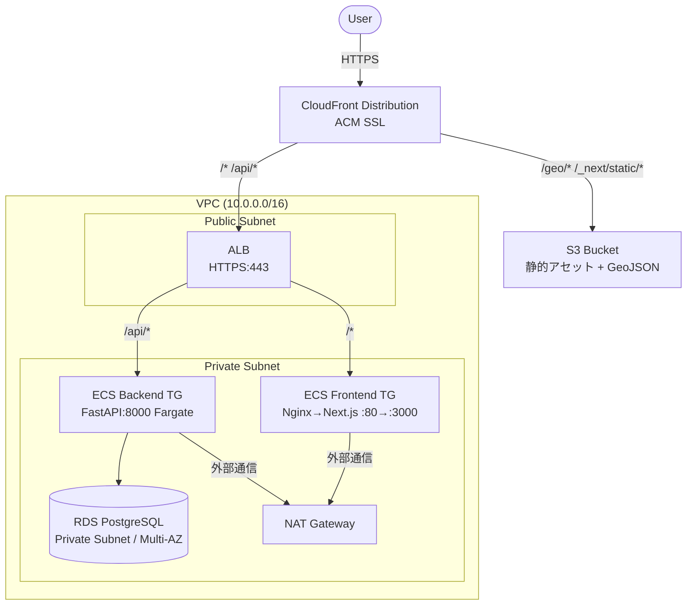
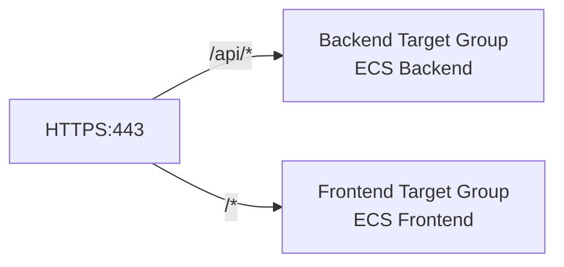
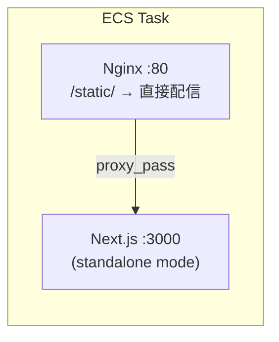
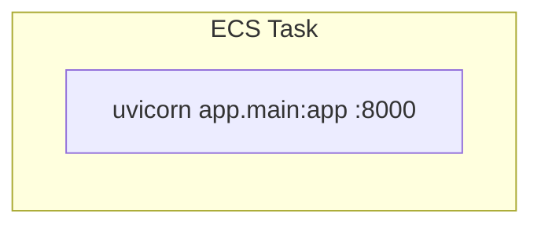
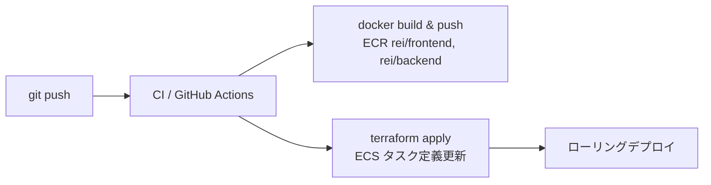

# インフラアーキテクチャ設計

## 概要

property_analyze アプリケーション（Next.js + FastAPI + PostgreSQL）の AWS インフラ構成。  
Terraform によるプロビジョニング、ECR を用いたコンテナベースのデプロイを前提とする。

---

## 全体アーキテクチャ図



---

## CloudFront — Cache Behavior 設計

| Path Pattern | Origin | Cache Policy | 用途 |
|---|---|---|---|
| `/geo/*` | S3 | 長期キャッシュ (1年) | municipalities/towns.geojson（不変） |
| `/_next/static/*` | S3 | Immutable (1年) | Next.js static chunks |
| `/api/*` | ALB | No-cache | FastAPI エンドポイント |
| `/*` (Default) | ALB | 短期 or No-cache | Next.js SSR |

---

## ALB — Listener Rule 設計



---

## ECS コンテナ設計

### Frontend Task（Nginx + Next.js）



- Next.js は `output: 'standalone'` で最小ビルド
- Nginx が `/_next/static/` を直接配信、それ以外は `proxy_pass http://localhost:3000`

### Backend Task（FastAPI + Uvicorn）



---

## ECR リポジトリ

| リポジトリ名 | 内容 |
|---|---|
| `rei/frontend` | Next.js + Nginx イメージ |
| `rei/backend` | FastAPI + Uvicorn イメージ |

---

## Terraform ディレクトリ構成（infra/ 内部）

```
infra/
├── main.tf               # provider, backend (S3 + DynamoDB)
├── variables.tf
├── outputs.tf
├── locals.tf
│
├── modules/
│   ├── vpc/              # VPC, Subnet, IGW, NAT GW, Route Table
│   ├── ecr/              # ECR リポジトリ × 2
│   ├── ecs/              # Cluster, Task Definition, Service
│   ├── rds/              # RDS PostgreSQL, Subnet Group, SG
│   ├── alb/              # ALB, Target Group, Listener, Rule
│   ├── cloudfront/       # Distribution, Cache Policy, OAC
│   ├── s3/               # 静的アセット Bucket, Bucket Policy
│   ├── acm/              # Certificate (us-east-1, CloudFront 用)
│   ├── iam/              # ECS Task Role, Execution Role
│   └── secretsmanager/   # DB パスワード, API キー保管
│
└── environments/
    ├── dev/
    │   ├── main.tf
    │   └── terraform.tfvars
    └── prod/
        ├── main.tf
        └── terraform.tfvars
```

---

## 主要な設計ポイント

### 1. Next.js Standalone ビルド

`next.config.ts` に追加:
```ts
output: 'standalone',
```

Dockerfile 構成:
```dockerfile
FROM node:22-alpine AS builder
WORKDIR /app
COPY . .
RUN corepack enable && bun install --frozen-lockfile
RUN bun run build

FROM nginx:alpine AS runner
COPY --from=builder /app/.next/standalone /app
COPY --from=builder /app/.next/static /app/.next/static
COPY --from=builder /app/public /app/public
COPY nginx.conf /etc/nginx/nginx.conf
# supervisord 等で nginx と node を同時起動
```

### 2. Nginx 設定

```nginx
server {
    listen 80;

    location /_next/static/ {
        root /app;
        expires 1y;
        add_header Cache-Control "public, immutable";
    }

    location /geo/ {
        root /app/public;
        expires 30d;
    }

    location / {
        proxy_pass http://localhost:3000;
        proxy_set_header Host $host;
        proxy_set_header X-Real-IP $remote_addr;
    }
}
```

### 3. API_BASE_URL の解決

ECS 内では ECS Service Connect または ALB 内部 DNS で解決:

```
API_BASE_URL=http://backend.rei.internal:8000
```

### 4. RDS 接続

- Secrets Manager にパスワードを保管
- ECS Task Role に `secretsmanager:GetSecretValue` を付与
- Security Group: ECS Backend の SG からのみ 5432 番ポートを許可

### 5. GeoJSON の S3 移管

現在 `public/geo/` にある静的ファイルを S3 + CloudFront で配信することで ECS のメモリ・帯域を削減。

---

## コスト概算（東京リージョン、最小構成）

| サービス | 構成 | 月額概算 |
|---|---|---|
| ECS Fargate（Frontend） | 0.25vCPU / 0.5GB × 1 | ~$5 |
| ECS Fargate（Backend） | 0.25vCPU / 0.5GB × 1 | ~$5 |
| RDS PostgreSQL | db.t4g.micro, シングル AZ | ~$15 |
| ALB | 1台 | ~$18 |
| CloudFront | 〜10GB/月 | ~$1 |
| S3 | 数 MB | ~$0 |
| NAT Gateway | 1台 | ~$32 |
| ECR | 2 リポジトリ | ~$1 |
| **合計** | | **~$77/月** |

> NAT Gateway が最大のコストドライバー。  
> 開発環境では Public Subnet に ECS を置いて NAT を省略することで ~$40/月 程度に削減可能。

---

## デプロイフロー（想定）



---

## 段階的な実装計画

| Phase | 内容 |
|---|---|
| Phase 1 | Dockerfile 整備（frontend/backend）+ ECR push |
| Phase 2 | VPC + RDS + ECS + ALB でコンテナデプロイ確立 |
| Phase 3 | CloudFront + S3 追加、静的アセット・GeoJSON をオフロード |
| Phase 4 | ACM + 独自ドメイン + HTTPS 化 |
| Phase 5 | CI/CD パイプライン構築（GitHub Actions） |
