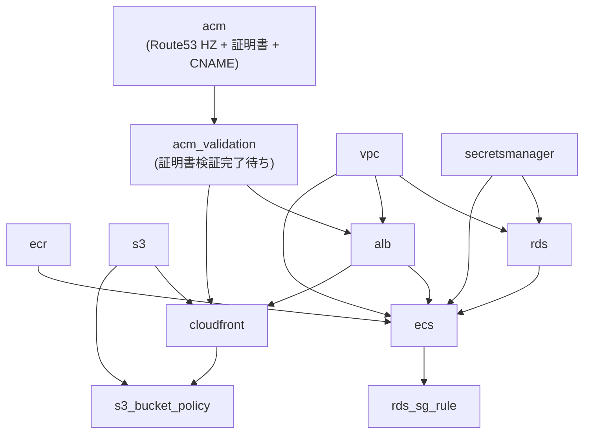

# プロビジョニング手順

## 前提条件

- AWS CLI が設定済みであること（`aws sts get-caller-identity` で確認）
- Terragrunt がインストール済みであること
- `nkajitani.com` ドメインをレジストラで所有済みであること

---

## ユニット依存関係図



---

## 環境変数ファイルの設定

apply 前に環境ごとの変数ファイルを編集する。

**`live/_env/dev.hcl`**
```hcl
root_domain_name = "nkajitani.com"   # Route53 で管理するルートドメイン
domain_name      = "dev.nkajitani.com"  # dev 環境のサブドメイン
```

**`live/_env/prod.hcl`**
```hcl
root_domain_name = "nkajitani.com"
domain_name      = "nkajitani.com"   # prod は apex ドメインを使用する場合
```

---

## dev 環境のプロビジョニング手順

### Phase 1: Route53 + ACM 証明書を作成する

```bash
cd /app/live/dev/acm
terragrunt apply
```

作成されるリソース:
- Route53 ホストゾーン（`nkajitani.com`）
- ACM 証明書 × 2（CloudFront 用: us-east-1 / ALB 用: ap-northeast-1）
- DNS 検証用 CNAME レコード

apply 完了後、ネームサーバーを確認する:

```bash
terragrunt output route53_name_servers
```

出力例:
```
[
  "ns-1106.awsdns-10.org",
  "ns-1573.awsdns-04.co.uk",
  "ns-252.awsdns-31.com",
  "ns-770.awsdns-32.net",
]
```

### Phase 2: レジストラの NS レコードを変更する

`nkajitani.com` を登録しているドメインレジストラにログインし、  
ネームサーバーを Phase 1 で確認した **4つの値** に書き換える。

NS 伝播を確認する（AWS の NS が返ってくれば OK）:

```bash
dig NS nkajitani.com +short
```

> NS の伝播には通常 数十分〜数時間かかる。最大 48 時間。

### Phase 3: 証明書検証を完了させる

NS 伝播確認後に実行する。数分で完了する。

```bash
cd /app/live/dev/acm_validation
terragrunt apply
```

### Phase 4: 残りのユニットを apply する

Phase 3 完了後、以下の順序で apply する。  
`※` のついたユニットは並行して apply してよい。

```bash
# ※ 並行 apply 可能（互いに依存しない）
cd /app/live/dev/vpc && terragrunt apply
cd /app/live/dev/secretsmanager && terragrunt apply
cd /app/live/dev/ecr && terragrunt apply
cd /app/live/dev/s3 && terragrunt apply

# vpc + secretsmanager の完了後
cd /app/live/dev/rds && terragrunt apply

# vpc + acm_validation の完了後
cd /app/live/dev/alb && terragrunt apply

# vpc + ecr + alb + rds + secretsmanager の完了後
cd /app/live/dev/ecs && terragrunt apply

# ecs + rds の完了後（循環依存解消）
cd /app/live/dev/rds_sg_rule && terragrunt apply

# s3 + alb + acm_validation の完了後
cd /app/live/dev/cloudfront && terragrunt apply

# s3 + cloudfront の完了後（循環依存解消）
cd /app/live/dev/s3_bucket_policy && terragrunt apply
```

### Phase 5: RDS パスワードを本番用に変更する

Terraform が設定する初期値はプレースホルダーのため、apply 後に実際のパスワードに変更する。

```bash
aws secretsmanager put-secret-value \
  --secret-id rei/dev/db_password \
  --secret-string "YourStrongPassword123!" \
  --region ap-northeast-1
```

> 使用可能文字: 英数字および `!#$%^&*()-_=+[]{}|;:,.<>?`  
> 使用不可文字: `/` `@` `"` スペース

---

## prod 環境のプロビジョニング手順

基本的な手順は dev と同じ。パスを `live/prod/` に読み替える。

```bash
# Phase 1
cd /app/live/prod/acm && terragrunt apply
terragrunt output route53_name_servers
# → レジストラで NS を設定（dev と同じホストゾーンを使う場合はスキップ）

# Phase 3
cd /app/live/prod/acm_validation && terragrunt apply

# Phase 4（dev と同じ順序で live/prod/ 配下を apply）
cd /app/live/prod/vpc && terragrunt apply
cd /app/live/prod/secretsmanager && terragrunt apply
cd /app/live/prod/ecr && terragrunt apply
cd /app/live/prod/s3 && terragrunt apply
cd /app/live/prod/rds && terragrunt apply
cd /app/live/prod/alb && terragrunt apply
cd /app/live/prod/ecs && terragrunt apply
cd /app/live/prod/rds_sg_rule && terragrunt apply
cd /app/live/prod/cloudfront && terragrunt apply
cd /app/live/prod/s3_bucket_policy && terragrunt apply

# Phase 5
aws secretsmanager put-secret-value \
  --secret-id rei/prod/db_password \
  --secret-string "YourStrongPassword123!" \
  --region ap-northeast-1
```

---

## 全環境を一括 destroy する場合

```bash
# 依存の逆順で destroy する
cd /app/live/dev/s3_bucket_policy && terragrunt destroy
cd /app/live/dev/cloudfront && terragrunt destroy
cd /app/live/dev/rds_sg_rule && terragrunt destroy
cd /app/live/dev/ecs && terragrunt destroy
cd /app/live/dev/alb && terragrunt destroy
cd /app/live/dev/rds && terragrunt destroy
cd /app/live/dev/s3 && terragrunt destroy
cd /app/live/dev/ecr && terragrunt destroy
cd /app/live/dev/secretsmanager && terragrunt destroy
cd /app/live/dev/vpc && terragrunt destroy
cd /app/live/dev/acm_validation && terragrunt destroy
cd /app/live/dev/acm && terragrunt destroy
```

---

## よくあるエラーと対処

| エラー | 原因 | 対処 |
|--------|------|------|
| `certificate validation timeout` | NS がレジストラに反映されていない | `dig NS nkajitani.com` で NS を確認し、反映後に `acm_validation` を再 apply |
| `MasterUserPassword is not valid` | RDS パスワードに使用不可文字が含まれている | Secrets Manager の値を確認し、使用可能文字のみに変更する |
| `BucketAlreadyExists` | S3 バケット名が他アカウントと衝突 | `live/_env/dev.hcl` のプロジェクト名を変更する |
| `ResourceNotFoundException` (Secrets Manager) | RDS apply 前に Secrets Manager が作成されていない | `secretsmanager` → `rds` の順序で apply する |
